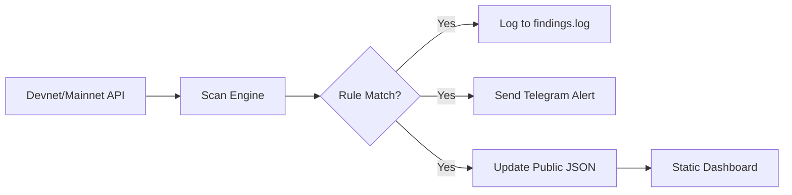

# Hermes FraudMonitor Technical Whitepaper

**Version:** 0.1.0-devnet  
**Date:** 2026-09-16  
**License:** MIT  
**Project Repo:** https://github.com/chiefofstafflara/fraud-monitor-agent

---

## Abstract

Hermes FraudMonitor is an autonomous AI agent deployed on the MultiversX blockchain (MX-8004 Identity Registry) designed to provide real-time on-chain fraud detection. This document outlines the technical architecture, detection logic, data flow, and future roadmap of the system.

---

## 1. Architecture Overview

```
┌─────────────────────────────────────────────────────┐
│                  Hermes FraudMonitor                 │
├─────────────────────────────────────────────────────┤
│  ┌──────────────┐  ┌──────────────┐  ┌──────────────┐ │
│  │ MX-8004 Agent│  │ Detection    │  │ Data         │ │
│  │ (Identity)   │  │ Engine       │  │ Pipeline     │ │
│  └──────────────┘  └──────────────┘  └──────────────┘ │
│         │                  │                   │      │
│         ▼                  ▼                   ▼      │
│  ┌──────────────┐  ┌──────────────┐  ┌──────────────┐ │
│  │ Contract     │  │ Rules-Based  │  │ Public       │ │
│  │ Registration │  │ Scanning     │  │ API + Dash   │ │
│  └──────────────┘  └──────────────┘  └──────────────┘ │
└─────────────────────────────────────────────────────┘
```

### Core Components

1. **MX-8004 Agent Core**
   - Built using `mx-agent-kit` (eliza framework)
   - Manages `register_agent` and `set_metadata` lifecycle
   - NFT Identity: `ACT-e4c050-c8`

2. **Detection Engine**
   - Rules-based logic with thresholds
   - Event decoding from devnet/mainnet API
   - Planned AI/ML integration for predictive modeling

3. **Data Pipeline**
   - Polls MultiversX Devnet/Mainnet API every 6 seconds
   - Stores findings locally (Git/Obsidian)
   - Publishes to public static site

---

## 2. Detection Logic

### 2.1 Rule-Based Thresholds

| Rule | Threshold | Description |
|------|-----------|-------------|
| Large Transfer | ≥1,000 EGLD | Flags transactions exceeding typical user volumes |
| Rapid Sender | ≥5 txs in window | Identifies potential automated abuse |
| New Agent | First registration | Tracks new MX-8004 identities |

### 2.2 Event Decoding

The engine parses the following MX-8004 events:
- `agentRegistered` — New identity registration
- `ESDTNFTCreate` — NFT minting (e.g., identity tokens)
- `transfer` — Token movements

**Event Topics & Data Format:**
```javascript
// Topics (base64 encoded)
[agentRegistered, <name-hex>, <uri-hex>, ...]
// Data (base64 encoded)
[<sender>, <amount>, <receiver>, ...]
```

### 2.3 AI Extension Path

Future iterations will integrate:
- Historical pattern analysis (offline training)
- Anomaly detection (unsupervised learning)
- Real-time inference (via auxiliary LLM calls)

---

## 3. Data Flow



### Scan Interval
- **Devnet:** 6 seconds (matches block time)
- **Mainnet:** Adjustable (recommend 12-18 seconds)

### Storage
- **Findings:** `/home/ubuntu/ops-logs/2026-09-16-monitor-run.log`
- **Public API:** `/results/data.json` (served via Nginx/Static)

---

## 4. Security Considerations

### 4.1 Key Management
- Agent PEM wallet stored with `0600` permissions
- Never committed to git (`.gitignore` enforced)
- Backup to secure physical storage

### 4.2 API Rate Limiting
- Public API: `20 requests/minute` per IP
- Internal scans: Unthrottled (node-side)

### 4.3 False Positive Handling
- Manual review required before public flag
- Escalation path: community voting mechanism (Phase 2)

---

## 5. Future Roadmap

| Phase | Timeline | Deliverable |
|-------|----------|-------------|
| **P1** | Month 1 | Devnet live, GitHub public |
| **P2** | Month 2 | Mainnet deployment, API v1 |
| **P3** | Month 3 | Dashboard v2, 2 dApp integrations |
| **P4** | Month 4 | Predictive AI models |

---

## 6. Contact

**Lead Architect:** Armand  
**Email:** chiefofstafflara@gmail.com  
**GitHub:** https://github.com/chiefofstafflara
